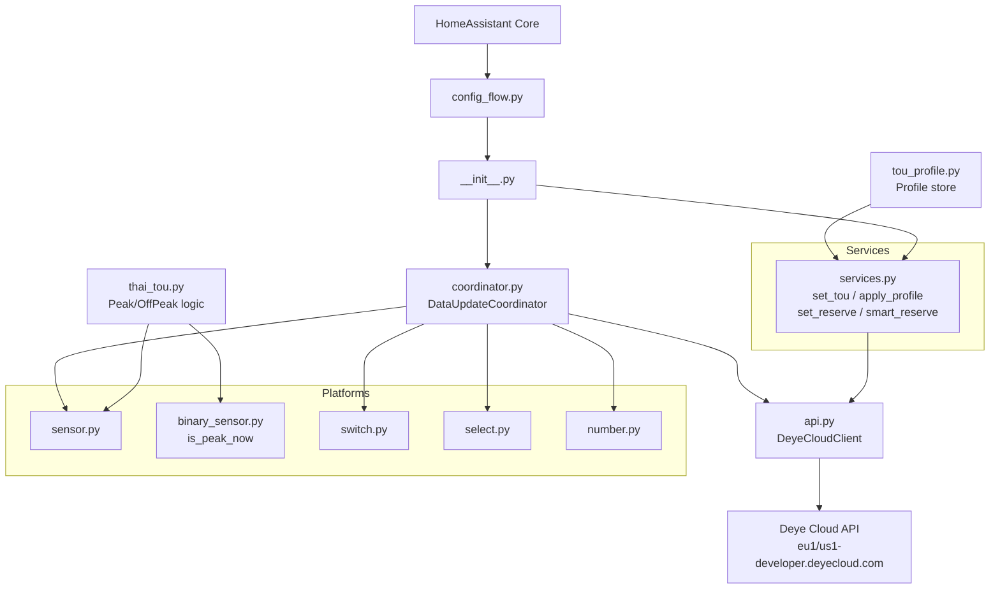

# Deye Cloud EMS — Home Assistant Custom Integration

## Context

- **Workspace**: `e:\Coding\hass-deyecloud-ems` (empty, greenfield)
- **Domain**: `deyecloud_ems` (separate from existing `deyecloud` read-only integration)
- **API auth**: `POST /account/token?appId={id}` → Bearer token (60-day expiry)
- **Reference repos**: [hass-deyecloud](https://github.com/heavenknows1978/hass-deyecloud) (read-only), [ha-deye-cloud-control](https://github.com/JayWhale/ha-deye-cloud-control) (control patterns)
- **Thai TOU**: Peak 09:00–22:00 Mon–Fri (4.1025 THB/kWh), Off-Peak 22:00–09:00 + Sat/Sun/holidays (2.5849 THB/kWh)

## Key API Endpoints

- Auth: `POST /account/token?appId={id}`
- Discovery: `POST /station/list`, `POST /station/device`
- Monitoring: `POST /device/latest`, `POST /station/latest`
- TOU: `POST /config/tou` (read), `POST /order/sys/tou/update` (write)
- Work Mode: `POST /order/sys/workMode/update`
- Energy Pattern: `POST /order/sys/energyPattern/update`
- Battery Mode: `POST /order/battery/modeControl`
- Battery Param: `POST /order/battery/parameter/update`
- Solar Sell: `POST /order/sys/solarSell/control`
- Max Sell Power: `POST /order/sys/power/update`
- Config read: `POST /config/battery`, `POST /config/system`

## File Structure

```
custom_components/deyecloud_ems/
  __init__.py          — platform setup, service registration
  manifest.json        — HA integration manifest
  config_flow.py       — UI config (credentials, region, update interval)
  const.py             — domain, config keys, mode enums, default TOU profiles
  api.py               — DeyeCloudClient (async, token cache, all control methods)
  coordinator.py       — DataUpdateCoordinator (polls every N seconds)
  thai_tou.py          — Thai TOU rate schedule utility (peak/off-peak, holiday list)
  tou_profile.py       — Named TOU profile manager (store, load, built-in presets)
  sensor.py            — device monitoring sensors + Thai TOU rate sensor
  binary_sensor.py     — Thai Peak indicator (is_peak_now)
  switch.py            — Solar Sell, Battery Charge Mode
  select.py            — Work Mode, Energy Pattern
  number.py            — Max Charge/Discharge Current, Max Sell Power, Battery Reserve SOC
  services.py          — all HA service handlers
  services.yaml        — service schema definitions
  strings.json         — UI label strings
  translations/en.json
blueprints/automation/
  deyecloud_ems_thai_daily.yaml   — 4-step daily Thai TOU smart automation
  deyecloud_ems_sunny_day.yaml    — manual sunny day profile
  deyecloud_ems_rainy_day.yaml    — manual rainy day profile
hacs.json
README.md
.gitignore
```

## Architecture



## Thai TOU Smart Management

### Thai TOU Schedule (`thai_tou.py`)
Utility class that knows the full Thai MEA/PEA TOU schedule:

- **Peak**: 09:00–22:00, Monday–Friday (excluding public holidays)
- **Off-Peak**: 22:00–09:00 Mon–Fri + all day Sat/Sun + public holidays
- Rates (2026): Peak = 4.1025 THB/kWh, Off-Peak = 2.5849 THB/kWh (+ Ft 0.1623 + 7% VAT)
- Provides: `is_peak_now()`, `current_rate_thb()`, `minutes_to_next_transition()`, `is_holiday(date)`
- Built-in holiday calendar (MEA/PEA 2026 list from กกพ.)

### TOU Profiles (`tou_profile.py`)
Named profiles stored via `homeassistant.helpers.storage.Store` (persists across restarts).

**Built-in presets** (stored in `const.py`, cloned to profile store on first load):

| Profile | Description | Time Slots |
|---|---|---|
| `thai_sunny` | Sunny day — discharge battery during peak | Off-peak 00–09 reserve 20%, Solar day 09–17 reserve 5%, Peak 17–22 discharge reserve 5%, Off-peak 22–24 reserve 20% |
| `thai_rainy` | Rainy day — grid charge at night, hold reserve | Off-peak 00–09 grid charge to 70%, Day 09–17 hold 50%, Peak 17–22 use reserve to 30%, Off-peak 22–24 grid charge to 70% |
| `ev_night` | EV charging night — keep battery charged via grid | Off-peak 22–09 grid charge to 90% (EV friendly), Day 09–22 hold 40% |

### 4-Step Daily Automation Blueprint (`deyecloud_ems_thai_daily.yaml`)

The blueprint runs 4 time-triggered automations per day. User configures:
- `inverter_device_id` — target inverter entity
- `solar_forecast_sensor` — any sensor that gives expected PV kWh for today (e.g. `sensor.solcast_forecast_today`, `sensor.energy_production_today`)
- `expected_solar_kwh` — threshold above which the day is considered "sunny" (configurable, default 10 kWh)
- `high_soc_threshold` — SOC % to trigger peak discharge mode (default 80)

```
06:00  Evaluate solar forecast sensor
       → if forecast_value > expected_solar_kwh → apply "thai_sunny" profile
       → else → apply "thai_rainy" profile
       → fires event: deyecloud_ems_profile_applied

11:00  Check actual PV power now
       → if current PV power < 30% of (expected_solar_kwh / 8 * 1000) W
         → call service: set_reserve(soc=50)  ← raise reserve since solar underperforming
       → else → keep current profile

17:00  Check battery SOC
       → if SOC >= high_soc_threshold → apply work_mode=SELLING_FIRST (discharge to grid during peak)
       → else if SOC >= 40 → energy_pattern=BATTERY_FIRST (power load from battery)
       → else → energy_pattern=LOAD_FIRST (preserve battery)

22:00  Off-peak starts
       → apply work_mode=ZERO_EXPORT_TO_LOAD
       → energy_pattern=BATTERY_FIRST (let grid fill battery)
       → set_reserve(soc=20)
```

## Platform Details

### `sensor.py` — Monitoring entities
From `/device/latest`:
- Battery SOC `%`, Battery Power `W`, Battery Voltage `V`
- PV1/PV2 Power `W`, Total PV Power `W`
- Grid Power `W`, Load Power `W`, AC Power `W`
- Inverter Temperature `°C`
- Daily Energy `kWh`, Total Energy `kWh`

Thai TOU-derived sensors (no API call, computed locally):
- **Thai TOU Rate Now** — current electricity rate in THB/kWh
- **Thai TOU Period** — "Peak" or "Off-Peak" text state
- **Active TOU Profile** — name of last applied profile (stored in `hass.data`)

### `binary_sensor.py`
- **Is Peak Now** — `True` 09:00–22:00 Mon–Fri (non-holiday), `False` otherwise

### `number.py` — Numeric controls
- Max Charge Current `A` (0–100) → `/order/battery/parameter/update`
- Max Discharge Current `A` (0–100) → `/order/battery/parameter/update`
- Max Sell Power `W` (0–10000) → `/order/sys/power/update`
- **Battery Reserve SOC** `%` (0–100) → sets minimum SOC in active TOU slot

### `services.yaml` — Automation services

| Service | Purpose | Key fields |
|---|---|---|
| `set_tou` | Push raw TOU schedule to inverter | `device_id`, `tou_items` (list) |
| `apply_tou_profile` | Apply a named profile | `device_id`, `profile_name` |
| `set_reserve` | Set minimum battery SOC | `device_id`, `soc` (0–100) |
| `smart_reserve` | Auto-calculate reserve from forecast | `device_id`, `forecast_kwh`, `target_kwh` |
| `set_battery_parameter` | Generic battery param | `device_id`, `parameter`, `value` |

### `select.py` — Mode selects
- Work Mode: `SELLING_FIRST` / `ZERO_EXPORT_TO_LOAD` / `ZERO_EXPORT_TO_CT`
- Energy Pattern: `BATTERY_FIRST` / `LOAD_FIRST`

### `switch.py` — Toggles
- Solar Sell on/off
- Battery Charge Mode (Grid Charge) on/off

## TOU Slot Payload Structure

Each slot sent to `POST /order/sys/tou/update`:

```json
{
  "deviceSn": "XXXXX",
  "timeUseSettingItems": [
    { "startTime": "00:00", "endTime": "09:00", "soc": 20, "chargeMode": "GRID_CHARGE" },
    { "startTime": "09:00", "endTime": "17:00", "soc": 5,  "chargeMode": "SOLAR_CHARGE" },
    { "startTime": "17:00", "endTime": "22:00", "soc": 5,  "chargeMode": "DISCHARGE" },
    { "startTime": "22:00", "endTime": "24:00", "soc": 20, "chargeMode": "GRID_CHARGE" }
  ],
  "timeoutSeconds": 30
}
```

## Cost Savings Intelligence (New Layer)

### Cost Tracking Sensors (pure computation, no extra API)

These sensors track real THB savings by multiplying grid/solar/battery power against the current TOU rate using HA's `statistics` integration on existing power sensors:

- `sensor.today_grid_cost_thb` — grid kWh × current rate (accumulated daily)
- `sensor.today_solar_savings_thb` — solar kWh self-consumed × peak rate avoided
- `sensor.today_battery_savings_thb` — battery kWh discharged during Peak × 1.52 THB (arbitrage)
- `sensor.monthly_grid_cost_thb` — rolling monthly total

Implementation: use HA `Riemann sum integral` helper on `grid_power` sensor, split by `is_peak_now`.

### Smart Night Charge Decision Service (`smart_night_charge`)

Called at ~21:30 each evening before Off-Peak starts:

```
inputs:
  forecast_kwh_tomorrow  — from Solcast / Open-Meteo / any sensor
  daily_consumption_kwh  — user-configured estimate (e.g. 15 kWh)
  battery_capacity_kwh   — user-configured (e.g. 10 kWh)
  current_soc            — from battery SOC sensor

logic:
  solar_surplus = forecast_kwh_tomorrow - daily_consumption_kwh
  if solar_surplus > 0.7 * battery_capacity_kwh:
      → skip grid charge (solar will fill it, no need to buy off-peak)
  else:
      needed_kwh = battery_capacity_kwh - (current_soc/100 * battery_capacity_kwh)
      target_soc = min(90, current_soc + needed_kwh/battery_capacity_kwh*100)
      → apply_tou_profile with grid charge target = target_soc
```

Saves money by NOT buying off-peak power unnecessarily when solar will cover it.

### Thai Holiday Auto-Detection

`binary_sensor.is_thai_holiday` — True = Off-Peak all day (no Peak surcharge)

- Built-in 2026 MEA/PEA holiday list in `thai_tou.py`
- When holiday: blueprint skips aggressive peak-discharge logic (already Off-Peak)
- Auto-applies `thai_holiday` TOU profile (flat low reserve all day)

### Battery SOC Prediction Sensor

`sensor.battery_soc_predicted_17h` — estimate where SOC will be at 17:00:

```
predicted_soc = current_soc
  + (remaining_solar_hours × avg_pv_power × efficiency / battery_capacity) × 100
  - (remaining_hours × avg_consumption / battery_capacity) × 100
```

Used in the 17:00 automation step to decide the discharge strategy in advance (can be evaluated at 14:00 to act earlier if needed).

### EV Charging Coordination

Optional input in blueprint: `ev_charger_entity` — if provided:
- When EV is actively charging at night → raise battery reserve to 30% minimum (don't over-discharge)
- When EV finishes → lower reserve back to off-peak default

### Sell Surplus Window Logic (Solar Sell Automation)

Built into the `solar_sell` switch with a smart condition:
- Enable Solar Sell when: battery SOC > 90% AND `is_peak_now = True`
- Disable Solar Sell when: battery SOC < 50% (save battery for own use)
- User can override via manual toggle

### Recommended HA Integrations to Pair With

| Integration | Purpose | Cost |
|---|---|---|
| [Solcast](https://github.com/BJReplay/ha-solcast-solar) | Best PV forecast (panel-specific) | Free (10 calls/day) |
| Open-Meteo (built-in HA) | Weather + solar irradiance estimate | Free |
| [Riemann Sum Integral](https://www.home-assistant.io/integrations/integration/) | Convert W → kWh for cost sensors | Built-in |
| HA Energy Dashboard | Visualize cost breakdown | Built-in |

## Additional Blueprints

| Blueprint | Trigger | Action |
|---|---|---|
| `thai_daily_smart.yaml` | 06:00, 11:00, 17:00, 22:00 | Full 4-step Thai TOU logic |
| `smart_night_charge.yaml` | 21:30 daily | Decide grid charge based on tomorrow forecast |
| `solar_sell_window.yaml` | SOC changes | Enable/disable sell based on SOC + peak window |
| `holiday_mode.yaml` | `is_thai_holiday` turns True | Apply flat holiday profile |
| `sunny_day.yaml` | Manual or forecast-triggered | Force sunny profile |
| `rainy_day.yaml` | Manual or forecast-triggered | Force rainy profile |

## Implementation Notes

- `DeyeCloudClient` caches the token and refreshes 1 day before expiry (60-day token lifetime)
- Coordinator polls `/device/latest` + `/station/latest` every 60s (configurable 30–300s)
- All control entities extend `CoordinatorEntity`; state reflects live coordinator data
- `thai_tou.py` is pure Python (no HA dependencies) — easy to unit test
- `tou_profile.py` uses `homeassistant.helpers.storage.Store` for persistence
- Config flow validates credentials + at least one station accessible before saving
- `hacs.json` sets `"homeassistant": "2024.1.0"` minimum
- Holiday list hardcoded for 2026; can be extended via YAML override in future
- Cost sensors use HA native `Riemann sum integral` helper — no custom code needed, just configuration
- All cost calculations use 2026 rates (4.1025 / 2.5849 THB/kWh) stored in `const.py` — easy to update when ERC revises rates
